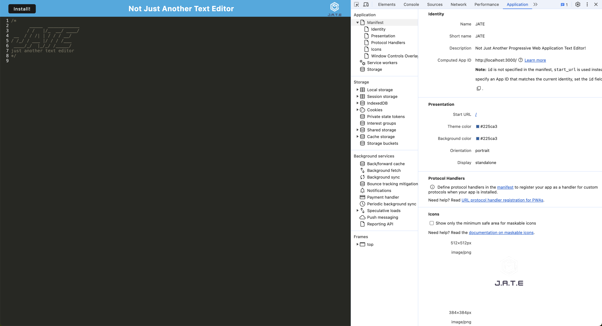
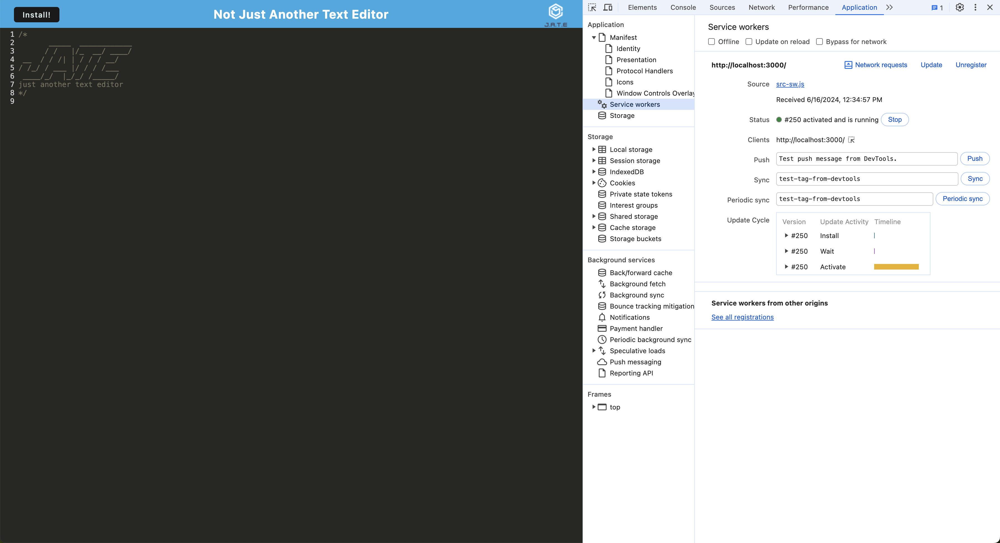
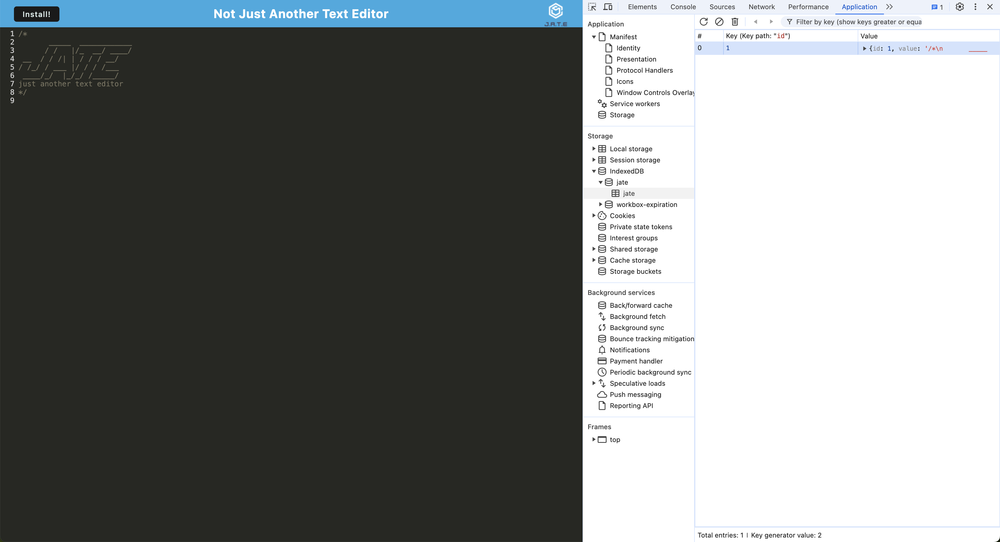
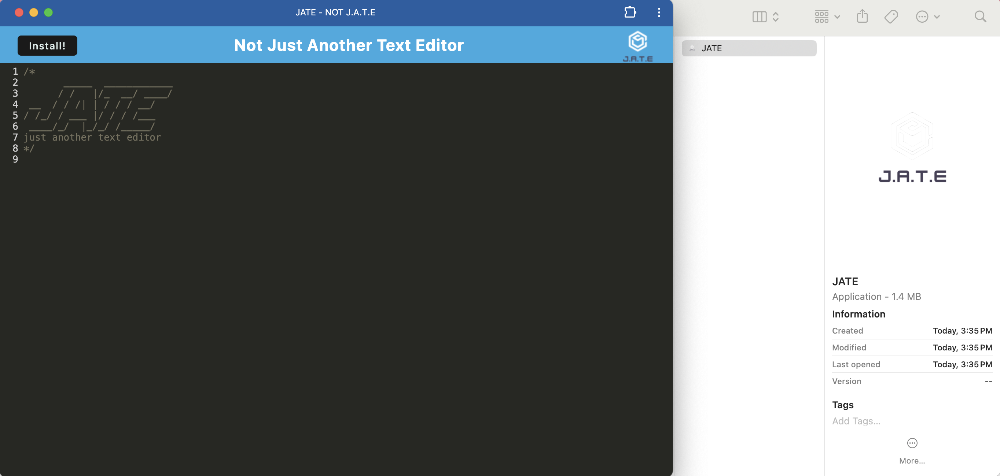

# Not JATE

## Table of Contents

* [Description](#description)
* [Installation](#installation)
* [Usage](#usage)
* [Credits](#credits)
* [Technologies Used](#technologies-used)
* [License](#license)

## Description
Not JATE is a progressive web application text editer that allows users to create and save notes or code snippets both online and offline. Not JATE features a number of data persistence techniques that serve as redundancy in case an option is not supported by a browser. The app can function locally and without an active network connection via an integrated service worker and cache API. 

Future development for this app could include functionality to create categories for separation and organization of saved notes.

## Installation
Access the app on [Heroku](https://not-jate-8eb2baa275ec.herokuapp.com/).

(OR)

[Clone the repository](https://github.com/eepitsporsche/not_jate) to your machine and open the application in VS Code.

1. Enter the command <code>npm init</code> into the VS Code terminal to install Node.

2. Enter <code>npm install</code> into the VS Code terminal to install the required dependencies.

## Usage
To initiate the Not JATE app on your local server, enter the <code>npm run start:dev</code> command into the VS Code terminal.

> [!IMPORTANT]
 Ensure you have installed all dependencies listed under [Installation](#installation) before initiating the program.

 To operate the app locally, click the "Install" button located at the top left of the Not JATE webpage.

*Manifest.json File:*

*Regiestered Service Worker:*

 
*IndexedDB Storage:*

 
*Local Install:*

## Credits

* [mpn web docs_](https://developer.mozilla.org/en-US/docs/Web/Manifest/display)
* [Git Ignore Template](https://gist.github.com/charlwillia6/5d5339afda47744d82cf77e190c8d660)
* [unblockMe YouTube Channel](https://www.youtube.com/watch?v=b8xUnZu4etU)
* UCB Bootcamp Instructor: [Robbert Wijtman](https://github.com/Bucky24)
* UCB Bootcamp provided front-end HTML, CSS, and text editor JavaScript functionality for this project

## Technologies Used
* [VS Code](https://code.visualstudio.com/)
* [JavaScript](https://www.javascript.com/)
* [Node.js](https://nodejs.org/en)
* [Express.js](https://expressjs.com/)
* [Webpack](https://webpack.js.org/)
* [Babel](https://babeljs.io/)
* [DotEnv](https://www.npmjs.com/package/dotenv)

## License
<a href="https://opensource.org/licenses/MIT">MIT License</a>

Copyright© 2024 Porsche Herskorn

Permission is hereby granted, free of charge, to any person obtaining a copy of this software and associated documentation files (the "Software"), to deal in the Software without restriction, including without limitation the rights to use, copy, modify, merge, publish, distribute, sublicense, and/or sell copies of the Software, and to permit persons to whom the Software is furnished to do so, subject to the following conditions:

The above copyright notice and this permission notice shall be included in all copies or substantial portions of the Software.

THE SOFTWARE IS PROVIDED "AS IS", WITHOUT WARRANTY OF ANY KIND, EXPRESS OR IMPLIED, INCLUDING BUT NOT LIMITED TO THE WARRANTIES OF MERCHANTABILITY, FITNESS FOR A PARTICULAR PURPOSE AND NONINFRINGEMENT. IN NO EVENT SHALL THE AUTHORS OR COPYRIGHT HOLDERS BE LIABLE FOR ANY CLAIM, DAMAGES OR OTHER LIABILITY, WHETHER IN AN ACTION OF CONTRACT, TORT OR OTHERWISE, ARISING FROM, OUT OF OR IN CONNECTION WITH THE SOFTWARE OR THE USE OR OTHER DEALINGS IN THE SOFTWARE.

### 
[Back to Top](#not-jate)
